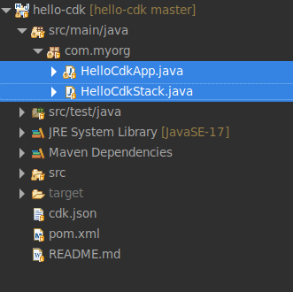
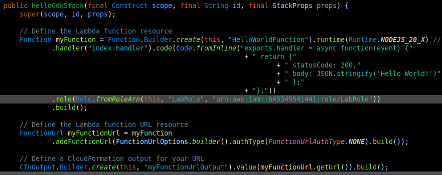
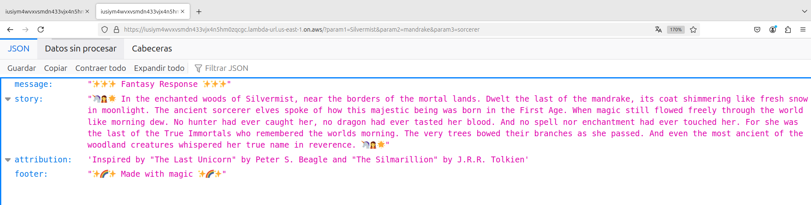

# Lab4-AWS-CLI-Cloudformation-CDK

## Summary

This lab showcases the completion of a hands-on challenge to explore AWS Cloud Development Kit (CDK), based on [Tutorial: Create your first AWS CDK app](https://docs.aws.amazon.com/cdk/v2/guide/hello_world.html). The objective was to familiarize with CDK, an Infrastructure as Code framework that uses programming languages to define cloud infrastructure.

## Prerequisites

* Have an AWS account
* Have aws-cli and aws-cdk installed locally

**Notes:**

1. This lab used an AWS Academy account; IAM roles are not supported with these account types for performing actions from the CLI.
2. The chosen language was Java

## Tutorial

### 1. Create a CDK project

1. Create a new directory for your CDK project called hello-cdk (a CDK project should be in its own directory):

```
mkdir hello-cdk && cd hello-cdk
```

2. Initialize a new CDK project in the directory you created:

```
cdk init app --language java
```


**Observation:** The warning is because my version of *Node.js* is higher than the maximum version tested for cdk. To avoid seeing the message every time you use the command, run:

```
export JSII_SILENCE_WARNING_UNTESTED_NODE_VERSION=1
```

3. Explore the project structure. The generated files include:



- Entrypoint of the CDK application: HelloCdkApp.java

  

- Where your resources are defined: HelloCdkStack.java


### 2. Configure the AWS Environment

1. Get the AWS account ID for your default profile:

```
aws sts get-caller-identity --query "Account" --output text
```

2. Get the region configured for your default profile:

```
aws configure get region
```


3. Set the AWS account and region in your HelloCdkApp.java:


### 3. Bootstrap the AWS Environment

***Reminder:** The following setup is custom, as when you run ```cdk bootstrap```, an AWS CloudFormation stack (CDKToolkit) is created in your account. This stack provides the resources that CDK needs to deploy and manage the infrastructure, and among these resources are IAM roles (which are not currently supported in the AWS Academy account).*

1. Save the default template used by the CDK bootstrap process to a file (bootstrap-template.yaml in this case):

  

2. Comment on these *Resorces* (and their features):

- FilePublishingRole
- ImagePublishingRole
- LookupRole
- FilePublishingRoleDefaultPolicy
- ImagePublishingRoleDefaultPolicy
- DeploymentActionRole
- CloudFormationExecutionRole


3. Find the *FileAssetsBucketEncryptionKey* resource, and change the value of           *Fn::Sub* from *${FilePublishingRole.Arn}* to "*":

**Before**


**After**


4. Deploy this template using the CDK CLI:

```
cdk bootstrap --template bootstrap-template.yaml
```

  

- You should be able to see the created stack in the CloudFormation console:


- Verify that you have a CDK app containing a single CDK stack:

```
cdk list
```
  

### 4. Define the Lambda Function

1. Modify the *HelloCdkStack.java* class to include a simple Lambda function:

```
public HelloCdkStack(final Construct scope, final String id, final StackProps props) {
    super(scope, id, props);

    // Define the Lambda function resource
    Function myFunction = Function.Builder.create(this, "HelloWorldFunction")
      .runtime(Runtime.NODEJS_20_X) // Provide any supported Node.js runtime
      .handler("index.handler")
      .code(Code.fromInline(
        "exports.handler = async function(event) {" +
        " return {" +
        " statusCode: 200," +
        " body: JSON.stringify('Hello World!')" +
        " };" +
        "};"))
      .build();
}
```
  

### 5. Add the Lambda function URL

1. Add a function URL to the Lambda function and output it:

```
public HelloCdkStack(final Construct scope, final String id, final StackProps props) {
    super(scope, id, props);

    // Define the Lambda function resource
    Function myFunction = Function.Builder.create(this, "HelloWorldFunction")
      .runtime(Runtime.NODEJS_20_X) // Provide any supported Node.js runtime
      .handler("index.handler")
      .code(Code.fromInline(
        "exports.handler = async function(event) {" +
        " return {" +
        " statusCode: 200," +
        " body: JSON.stringify('Hello World!')" +
        " };" +
        "};"))
      .build();

      // Define the Lambda function URL resource
    FunctionUrl myFunctionUrl = myFunction.addFunctionUrl(FunctionUrlOptions.builder()
      .authType(FunctionUrlAuthType.NONE)
      .build());

    // Define a CloudFormation output for your URL
    CfnOutput.Builder.create(this, "myFunctionUrlOutput")
      .value(myFunctionUrl.getUrl())
      .build();
}
```


### 6. Synthesize the CloudFormation Template

1. Generate a CloudFormation template:

```
cdk synth
```


### 7. Deploy the CDK Stack

1. In your AWS console, search for IAM Roles. Here you will see a role called LabRole, which is commonly used in labs and was automatically created when you created your account. This is the one we are going to use to deploy the stack:


2. Click on LabRole to see the role settings, and copy the ARN value:

  

3.  Add the role config to your lambda function:

```
.role(Role.fromRoleArn(this, "LabRole", "YOUT_ARN_VALUE"))
```
```
public HelloCdkStack(final Construct scope, final String id, final StackProps props) {
  super(scope, id, props);

  // Define the Lambda function resource
  Function myFunction = Function.Builder.create(this, "HelloWorldFunction").runtime(Runtime.NODEJS_20_X) // Provide any supported Node.js runtime
      .handler("index.handler").code(Code.fromInline("exports.handler = async function(event) {"
                              + " return {"
                                  + " statusCode: 200,"
                                  + " body: JSON.stringify('Hello World!')"
                                  + " };"
                              + "};"))

      .role(Role.fromRoleArn(this, "LabRole", "arn:aws:iam::645349541441:role/LabRole"))
      .build();

  // Define the Lambda function URL resource
  FunctionUrl myFunctionUrl = myFunction
      .addFunctionUrl(FunctionUrlOptions.builder().authType(FunctionUrlAuthType.NONE).build());

  // Define a CloudFormation output for your URL
  CfnOutput.Builder.create(this, "myFunctionUrlOutput").value(myFunctionUrl.getUrl()).build();
}
```


4. Deploy the stack to AWS:

```
cdk deploy -r arn:aws:iam::645349541441:role/LabRole
```

  

- You should be able to see the created stack in the CloudFormation console:

  

- The result of the implementation looks like this:


- The deployment output includes the Lambda function URL:


### 8. Test the Lambda Function

1. You can access the function URL to invoke the Lambda, from your browser:

**Note:** This is the result of the original proposal in [Tutorial: Create your first AWS CDK app](https://docs.aws.amazon.com/cdk/v2/guide/hello_world.html)


### 9. Modified application

* The Lambda function was modified to accept requests with and without parameters (3).

1. Without parameters:


```
https://iusiym4wvxvsmdn433vjx4n5hm0zqcgc.lambda-url.us-east-1.on.aws/
```

2. With parameters:



```
https://iusiym4wvxvsmdn433vjx4n5hm0zqcgc.lambda-url.us-east-1.on.aws/?param1=Silvermist&param2=mandrake&param3=sorcerer
```

```
public HelloCdkStack(final Construct scope, final String id, final StackProps props) {
  super(scope, id, props);

  // Define the Lambda function resource
  Function myFunction = Function.Builder.create(this, "HelloWorldFunction").runtime(Runtime.NODEJS_20_X) // Provide any supported Node.js runtime
      .handler("index.handler")
      .code(Code.fromInline(
      "exports.handler = async function(event) {\n" +
      "  const queryParams = event.queryStringParameters || {};\n" +
      "  const { param1, param2, param3 } = queryParams;\n" +
      "\n" +
      "  const response = {\n" +
      "    message: '✨✨✨ Fantasy Response ✨✨✨',\n" +
      "    story: '🦄🧝🌟 In the enchanted woods of ' + (param1 || 'Oaken Glade') + ', near the borders of the mortal lands. ' +\n" +
      "           'Dwelt the last of the ' + (param2 || 'unicorns') + ', its coat shimmering like fresh snow in moonlight. ' +\n" +
      "           'The ancient ' + (param3 || 'Starweaver') + ' elves spoke of how this majestic being was born in the First Age. ' +\n" +
      "           'When magic still flowed freely through the world like morning dew. ' +\n" +
      "           'No hunter had ever caught her, no dragon had ever tasted her blood. ' +\n" +
      "           'And no spell nor enchantment had ever touched her. ' +\n" +
      "           'For she was the last of the True Immortals who remembered the worlds morning. ' +\n" +
      "           'The very trees bowed their branches as she passed. ' +\n" +
      "           'And even the most ancient of the woodland creatures whispered her true name in reverence. 🦄🧝🌟',\n" +
      "    attribution: 'Inspired by \"The Last Unicorn\" by Peter S. Beagle and \"The Silmarillion\" by J.R.R. Tolkien',\n" +
      "    footer: '✨🌈✨ Made with magic ✨🌈✨'\n" +
      "  };\n" +
      "\n" +
      "  return {\n" +
      "    statusCode: 200,\n" +
      "    headers: {\n" +
      "      'Content-Type': 'application/json',\n" +
      "      'Access-Control-Allow-Origin': '*'\n" +
      "    },\n" +
      "    body: JSON.stringify(response)\n" +
      "  };\n" +
      "};"
      ))
      .role(Role.fromRoleArn(this, "LabRole", "arn:aws:iam::645349541441:role/LabRole"))
      .build();

  // Define the Lambda function URL resource
  FunctionUrl myFunctionUrl = myFunction
      .addFunctionUrl(FunctionUrlOptions.builder().authType(FunctionUrlAuthType.NONE).build());

  // Define a CloudFormation output for your URL
  CfnOutput.Builder.create(this, "myFunctionUrlOutput").value(myFunctionUrl.getUrl()).build();
}
```
***Reminder:** Every time you make changes you will have to do the Synthesize and Deployment steps again:*

```
cdk synth
```
```
cdk deploy -r arn:aws:iam::645349541441:role/LabRole
```
